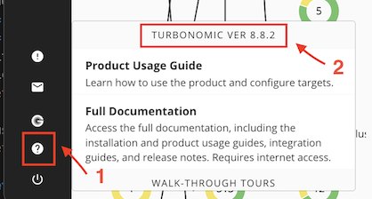

# PoT KubeTurbo

This is a guide to easily configure KubeTurbo for the PoT environment.

1. In the Turbonomic user interface, navigate to **Settings -> User Management**.
2. Select **NEW LOCAL USER**.
3. Fill in the user details as follows:
   - **USERNAME**: kubeturbo
   - **PASSWORD**: password (or any desired password)
   - **ROLE**: Site Administrator (default)
4. Click on **SAVE**.

Next, follow these steps:

1. On the bastion of your VM, open the terminal and run the following command: `ssh -p 2022 cocuser@10.0.0.3`.
2. After successfully connecting via SSH to the master of your cluster, clone the following repository: `git clone https://github.com/ssnivlek/kube-turbo-pot.git`.
3. Now, using nano or vim, open the kube-turbo.yaml file: `nano kube-turbo.yaml` or `vim kube-turbo.yaml`.
4. Inside the file, make the following modifications:

   - `"turboServer": "https://<Turbo_server_URL>"`
     - In this line, replace it with the desired access URL for Turbonomic, in this case: `"https://10.0.0.1"`.
   - `"opsManagerPassword": "<Turbo_password>"`
     - Enter the default password that you created or the password that was modified during the creation of the kubeturbo user.
   - `"targetName": "NOME_DO_CLUSTER"`
     - Enter the desired name for the cluster, for example: `"pot-test"` or `"pot-kubeturbo"`.
   - `icr.io/cpopen/turbonomic/kubeturbo:8.9.1`
     - Modify `8.9.1` with the version of Turbonomic in your environment.
       - You can find the version by clicking on the small question mark icon in the lower-left corner of the Turbonomic Dashboard and noting the version (see the image below for reference):
         

5. Save the modified file.
6. Execute the following command: `kubectl apply -f kube-turbo.yaml`.
7. The deployment will be created automatically, and a pod will be launched. To verify, run the command `kubectl get pods --all-namespaces` and check if a pod with the name `kube-turbo-<series of digits>` is present in the "turbo" namespace.
8. Back in your control panel, your KubeTurbo target should appear with the name of the cluster you edited in the YAML file earlier.
