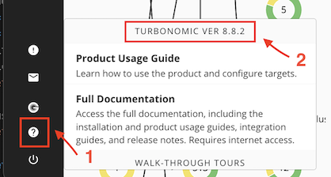

# PoT KubeTurbo

Este é um guia para configurar de maneira mais simples o KubeTurbo para o ambiente PoT

1. Na interface de usuário do Turbonomic, navegue até **Settings -> User Management**
2. Selecione **NEW LOCAL USER**
3. Preencha os detalhes do usuário da seguinte forma:
   - **USERNAME**: kubeturbo
   - **PASSWORD**: password (ou qualquer senha desejada)
   - **ROLE**: Site Administrator (padrão)
4. Clique em **SAVE**.

Em seguida, siga os seguintes passos:

1. No bastion de sua VM, abra o terminal e digite o seguinte comando: `ssh -p 2022 cocuser@10.0.0.3`

2. Após se conectar via SSH no master de seu cluster, clone o seguinte repositório: `git clone https://github.com/ssnivlek/kube-turbo-pot.git`

3. Agora, utilizando o nano ou vim, abra o arquivo kube-turbo.yaml: `nano kube-turbo.yaml` ou `vim kube-turbo.yaml`

4. Dentro do arquivo, faça as seguintes modificações:

   - `"turboServer": "https://<Turbo_server_URL>"`
     - Nesta linha, modifique para a URL de acesso do Turbonomic desejada, como por exemplo: `"https://10.0.0.1"`
   - `"opsManagerPassword": "<Turbo_password>"`
     - Digite a senha padrão que você criou ou a senha que foi modificada nos passos anteriores ao se criar o usuário kubeturbo
   - `"targetName": "NOME_DO_CLUSTER"`
     - Digite o nome desejado para o cluster, como por exemplo: `"pot-test"` ou `"pot-kubeturbo"`
   - `icr.io/cpopen/turbonomic/kubeturbo:8.9.1`
     - Modifique `8.9.1` para a versão do Turbonomic em seu ambiente
       - A versão pode ser verificada no pequeno ícone de interrogação no canto inferior esquerdo do Dashboard do Turbonomic, provavelmente a versão também será a `8.8.2` como demonstra a imagem:
         

5. Salve o arquivo modificado

6. Execute o seguinte comando: `kubectl apply -f kube-turbo.yaml`

7. Automaticamente, o deployment será criado e um pod será iniciado. Para verificar, execute o comando `kubectl get pods --all-namespaces` e verifique se um pod com o nome `kube-turbo-<série de dígitos>` está presente no namespace "turbo"

8. De volta ao seu painel de controle, seu target de KubeTurbo deverá aparecer com o nome do cluster que você editou no arquivo YAML anteriormente
